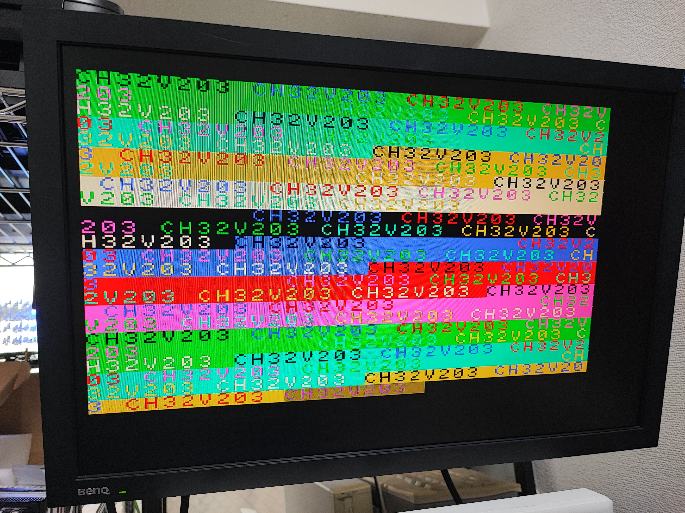
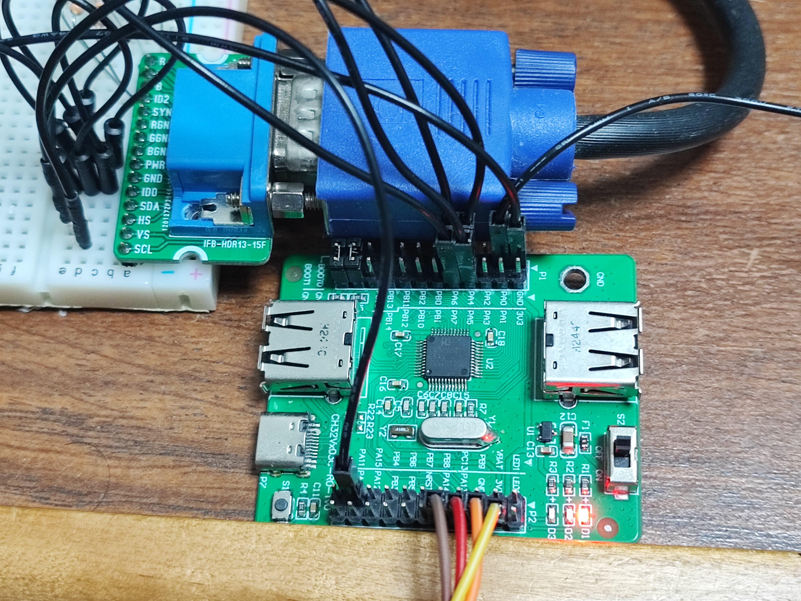
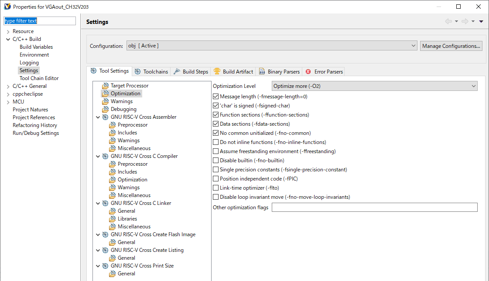

# VGA demo for CH32V203

This is VGA output demonstration for CH32V203.
Display resolution is 256x192 3bpp.

```
Pin connection:

PA11 -> H-Sync
PA4  -> V-Sync
PA5  -> B ( with 330 ohm register )
PA6  -> R ( with 330 ohm register )
PA7  -> G ( with 330 ohm register )
GND  -> all GND pins

```

You should use 144MHz clock and set optimize level `-O2`.

---
# VGA デモ for CH32V203

CH32V203 で VGA ディスプレイに出力するデモです。
画面の解像度は 256x192 の 8色で、32x24 のテキストVRAM をエミュレートしています。<br>




速度がギリギリなので、クロックは 144MHz で、最適化レベルは `-O2` 以上に設定してください。




## 解説

水平同期信号は TIM1 の CH4 で生成しています。
同じく CH2 で垂直同期信号を出力するかどうか、CH4 で映像信号を出力するかどうか割り込みをかけて処理しています。<br>

映像信号は、TIM2CH1 をクロックとして DMA を動かして GPIO に出力しています。
クロック自体はもっと上げられるのですけど、DMA の仕様上？14MHz 程度が限界のようです。<br>

ここでは 12MHz にクロックを設定して横 256 ドットとしています。
DMAの起動と同時に、次の行のデータを用意しますが、意外とフォントの処理に時間がかかるので、
水平同期期間(31.75us)ぎりぎりの時間がかかります。高速化の余地はありそうですが…<br>

デモでは縦は2行づつ同じものを表示させています。半分の期間は別の処理に回すことが可能です。

また、ここでは RGB 1bit づつの 8 色としていますが、同じ GPIO (GPIOA)で処理可能な範囲であれば bpp を増やすことが可能です。
<br>

## ドット列の出力方法について

汎用マイコンでVGA信号を生成するにあたっていくつかの方法を検討しましたが、
25MHz のクロックを扱うのはほぼ不可能という結論です。

- SPI を使う方法

モノクロビデオ信号を生成するときに使用した方法です、要は SPI をシフトレジスタとして使うものです。
マイコンにおいてはおそらく一番高いクロックを生成することが可能かと思いますが、
SPIの本数で色の数が決まってしまいます。

- CPU で GPIO をたたく方法

単純に画像を出力するだけなら一番確実な方法です。CH32V203でもおそらく 512x480 程度の表示は可能かと思われます。
タイミングを調整するのにアセンブラのプログラムが必要なのと、
フォント処理などの複雑な処理は難しいという欠点があります。

- GPIO を DMA でたたく方法

今回使った方法です。
STM32のように GPIO の特定のビットだけを操作可能なレジスタが存在するか、
おなじGPIOレジスタのほかのポートを無視することが可能なケースで使用可能です。
タイミングの調整をプログラムの方で行わなくてもハードウェアでやってくれるのがメリットです。
DMA の速度が映像信号を扱うには遅いので、解像度は低くなります。
<br>

こうやって考えると、PIO でシフトレジスタ処理できる Raspberry Pi Pico は優秀だね<br>